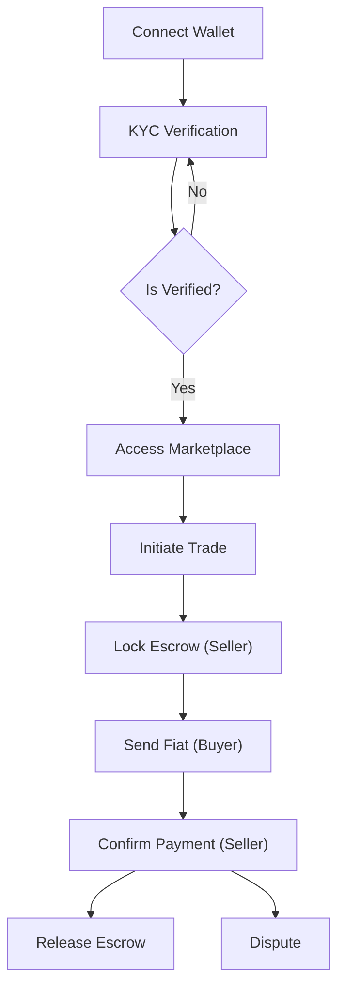

## 1. Product Overview
ProofRail Frontend is the user-facing web application for a Privacy-first P2P fiat-to-crypto on/off-ramp.
- It enables users to authenticate via their crypto wallet, complete KYC once (yielding a universal credential), and trade P2P securely across multiple chains (Midnight, Aleo, Fhenix) without re-verifying.
- The product aims to provide a seamless, secure, and privacy-preserving trading experience with built-in compliance and dispute resolution mechanisms.

## 2. Core Features

### 2.1 User Roles
| Role | Registration Method | Core Permissions |
|------|---------------------|------------------|
| Normal User | Wallet Signature | Authenticate, complete KYC, create/accept trades, manage escrow |
| Admin | Pre-configured | Resolve disputes, manual compliance overrides |

### 2.2 Feature Module
1. **Landing/Auth Page**: Hero section, wallet connection, and authentication.
2. **Dashboard/KYC**: User status overview, universal credential display, and KYC initiation.
3. **P2P Marketplace**: Trade listing, offer creation, and filtering by chain/fiat.
4. **Trade Escrow Room**: Active trade management, payment confirmation, and dispute initiation.

### 2.3 Page Details
| Page Name | Module Name | Feature description |
|-----------|-------------|---------------------|
| Landing Page | Hero section | Project introduction, "Connect Wallet" CTA, features overview |
| Dashboard | Status Panel | Displays KYC status, compliance tier, and universal credential info |
| Marketplace | Trade List | List of active P2P offers, filter controls, "Create Offer" button |
| Trade Room | Escrow State | Trade lifecycle management (LOCKED, PAYMENT_SENT, COMPLETED), chat/dispute |

## 3. Core Process
1. User connects wallet and signs message to log in.
2. User initiates and completes KYC to receive a universal credential.
3. User browses marketplace and accepts a P2P trade.
4. Seller locks crypto in escrow on-chain.
5. Buyer sends fiat and marks as paid.
6. Seller confirms receipt; escrow is released.

## 4. User Interface Design
### 4.1 Design Style
- **Theme**: "Cyber-Brutalist" mixed with high-end FinTech. High contrast dark mode.
- **Colors**: Deep obsidian backgrounds (`#0a0a0a`), neon cyan (`#00f0ff`) for primary actions, and stark white for typography.
- **Typography**: `Space Grotesk` or `Syne` for headers (geometric, tech-forward), `Inter` or `Geist` for readable body text.
- **Layout**: Asymmetric grids, visible borders, and floating glassmorphism panels for modals.
- **Motion**: Crisp, staggered reveal animations on page load. Micro-interactions with slight scale and glowing box-shadows on hover.

### 4.2 Page Design Overview
| Page Name | Module Name | UI Elements |
|-----------|-------------|-------------|
| Landing Page | Hero | Large typography, glowing gradient meshes in the background, sharp CTA buttons |
| Dashboard | Status Card | Glassmorphic cards with neon accents, progress rings for reputation |
| Marketplace | Data Grid | High-density table layout, monospaced numbers, stark dividers |

### 4.3 Responsiveness
- Desktop-first design.
- Mobile-adaptive with bottom sheet navigation and touch-optimized large tap targets for trade actions.
