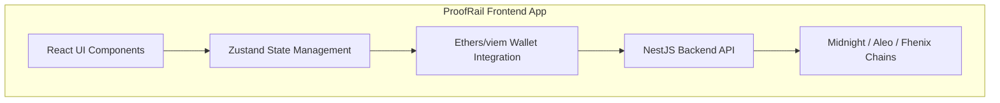
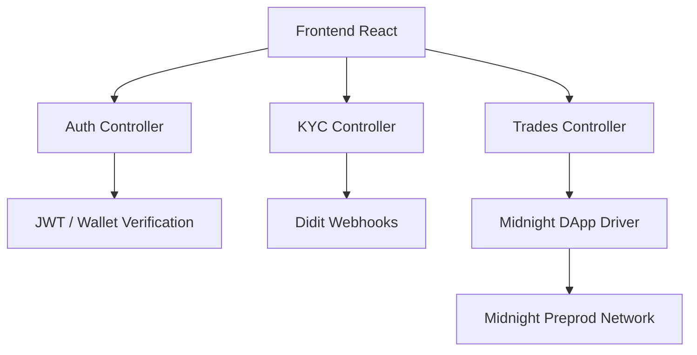
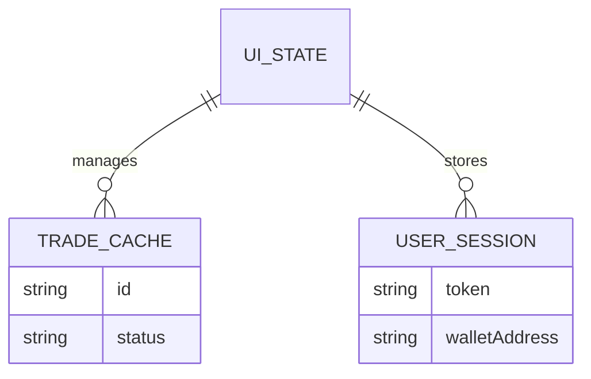

## 1. Architecture Design


## 2. Technology Description
- **Frontend**: React@18 + Tailwind CSS v3 + Vite
- **Initialization Tool**: `npm create vite@latest . -- --template react-ts`
- **State Management**: Zustand
- **Wallet Connection**: `viem` or `ethers` for signature generation.
- **Routing**: React Router DOM v6
- **Styling**: Tailwind CSS + `framer-motion` for animations.
- **Icons**: `lucide-react`

## 3. Route Definitions
| Route | Purpose |
|-------|---------|
| `/` | Landing page for unauthenticated users |
| `/dashboard` | User dashboard, KYC status, credential display |
| `/marketplace` | P2P trade listings and offer creation |
| `/trade/:id` | Specific trade escrow room (LOCKED, PAYMENT_SENT, COMPLETED) |
| `/disputes` | Dispute management (admin or user) |

## 4. API Definitions
The backend exposes REST endpoints built with NestJS. The frontend interacts using `axios` or `fetch`.

```typescript
type User = {
  id: string;
  walletAddress: string;
  role: 'USER' | 'ADMIN';
  kycStatus: 'APPROVED' | 'PENDING' | 'NOT_STARTED';
};

type Trade = {
  id: string;
  buyerId: string;
  sellerId: string;
  status: 'PENDING' | 'ESCROW_LOCKED' | 'PAYMENT_SENT' | 'COMPLETED' | 'DISPUTED';
  fiatAmount: number;
  fiatCurrency: string;
  assetAmount: number;
  assetSymbol: string;
};
```

## 5. Server Architecture Diagram


## 6. Data Model
### 6.1 Data Model Definition
The frontend primarily maintains UI state and caches server responses.

